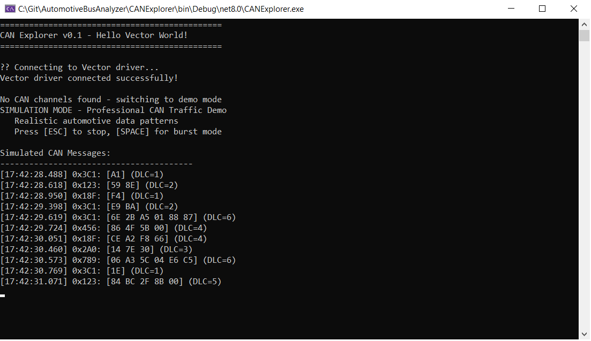

# Automotive Bus Analyzer

A professional CAN bus analysis tool built with C# and Vector XL API integration. Designed for real-time automotive communication monitoring and analysis.

## 🚀 Current Features (Stage 1)

- **Vector XL API Integration** - Native integration with Vector hardware drivers
- **Real-time CAN Message Monitoring** - Live display of CAN bus traffic
- **Intelligent Simulation Mode** - Hardware-independent operation for development
- **Automotive Data Interpretation** - Smart decoding of common vehicle signals
- **Professional Error Handling** - Robust fallback strategies

## 🖥️ Screenshots



```
CAN Explorer v0.1 - Hello Vector World!

Connecting to Vector driver...
Vector driver connected successfully!

Live CAN Messages:
[14:23:45.123] 0x123: [8A 1F 0C 55] (DLC=4)
   Engine: ~7708 RPM, Temp: ~138°C, Speed: ~85 km/h
[14:23:45.156] 0x456: [7D 2A 8C] (DLC=3)
   Battery: 12.5V, Current: 42A, SoC: 88%

Statistics: 247 messages total, 23.4 msg/sec
```

## 🛠️ Technical Stack

- **Language:** C# / .NET 6+
- **API Integration:** Vector XL Driver Library (vxlapi64.dll)
- **Architecture:** P/Invoke interoperability for native API access
- **Target Platform:** x64 Windows

## 🎯 Project Goals

This project demonstrates:
- Professional automotive software development practices
- Vector ecosystem integration capabilities
- Real-time data processing and analysis
- Scalable architecture for automotive applications

## 🚀 Getting Started

### Prerequisites
- Visual Studio 2022 or later
- .NET 6+ SDK
- Vector XL Driver Library (optional - simulation mode available)

### Building and Running
1. Clone the repository
2. Open in Visual Studio
3. Set platform target to x64
4. Build and run (F5)

The application will automatically detect available Vector hardware or switch to simulation mode.

## 📖 Learning Resources

- [Vector XL API Documentation](https://www.vector.com)
- [CAN Bus Protocol Fundamentals](https://en.wikipedia.org/wiki/CAN_bus)
- [Automotive Communication Protocols](https://www.iso.org/standard/63648.html)

## 📧 Contact

Built as part of professional development in automotive software engineering.

---
